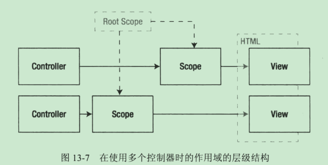

# 一、模块化基本介绍
## 模块化 angular.module(name,requires,config)
> name 新模块的名字 ，requires 该模块所依赖的模块集合（如果不指定该参数，则该方法的行为是去寻找name模块，而不是新建一个模块）， config 该模块的配置，通常不在第三参数进行配置，而是通过Module.config()方法  
**模块必须通过ng-app** 应用到html中 
## Module 对象成员方法
1. animation(name,factory) 支持动画
2. config(callback) 注册一个在该模块加载时对模块进行配置的函数
3. constant(key,value) 定义一个返回一个常量的服务
4. controller(name,constructor) 创建一个控制器
5. directive(name,factory) 创建一个指令
6. factory(name,provider) 创建一个服务
7. filter(name,factory) 创建一个进行数据格式化的过滤器
8. provider(name,type) 创建一个服务 
9. name 返回模块名称
10. run(callback) 注册一个在angularJs 加载完毕后用于对所有模块进行配置的函数
11. service(name,constructor) 创建一个服务
12. value(name,value) 定义一个返回一个常量的服务
> Module对象定义的方法返回的结果仍然是Module本身，使得能够使用*Fluent API*，进行多个方法调用
```js
var myApp =Angular.Module('MyApp',[]).controller('OneController',function($scope){
    console.log('模块1');
}).controller('TwoController',function($scope){
    console.log('模块2');
}).directive(...)
``` 
### 定义控制器 Module.controller(name,factory)
#### 依赖注入
> AngularJS 查找控制器中的参数，确定这是依赖于XXX组件，然后为其查找组件，并在控制器函数被调用时作为参数传递给工厂函数  
使用依赖注入的好处：Angular负责管理组件并在需要时提供给相应函数
1. 控制器应用于视图 ng-controller
### 定义指令 Module.directive(name,factory)
```js
myApp.directive('ExampleDirective',function(){
    // 工人函数
    return function(scope,element,attr){
        //... 
    }
})
```
> 当遇到HTML中的指令时AngularJS就会调用其中的工人函数   
element参数是一个jqLite对象

### 定义过滤取 Module.filter(name,factory)
```js
examApp.filter('StringFormat',function(){
    return function(str){
        if(str){
            return str.toString().substring(0,2);
        }
    }
})
```
1. 使用过滤器 
> 使用'|' 
```html
<p>{{'变成2个长度的字符串' | StringFormat}}</p>
```
> $filter  该服务允许访问我所有已定义的过滤器
```js
xxx.controller('xxController',function($filter){
    // 第一个括号内参数为filter名称
    $filter('StringFormat')('参数')
})
```
### 定义服务 service、factory、provider
#### Module.service()
```js
myApp.service('MyService',function(){
    // this 指代MyService实例对象
    // Angular代码在任何地方都可以通过该服务访问到本服务的属性和方法
    this.name = 'MyService';
    this.getName = function(){
        return this.name;
    };
    this.setName = function(value){
        this.name = value;
    }
})
myApp.controller('MyContorller',function($scope,MyService){
    // 即使controller定义在service之后，服务也会正常的被调用，并注入
})
```
#### Module.value()
> 用于创建返回固定值和对象的服务，意味着可以为任何值和服务使用依赖注入
```js
var now = new Data();
myApp.value('nowDate',now)
.service('DateService',function(now){
    this.getNow=function(){
        return now ;
    }
});
```

## **使用模块组织代码**
```js
angular.module('mainApp',['myApp']);
```
### 使用模块生命周期进行工作
1. Module.config()
    > 在当前模块被加载后调用  
    
    ```js
    mainApp.config(function(xxProvider,xxServiceProvider){
        
    })
    ```
2. Module.run()
    > 在所有模块被加载后调用

    ```js
    mainApp.run(function(){
        console.log('everything is be loaded! ')
    })
    ```

# 二、详细讲解
## 使用绑定和模版指令
2.1 使用数据绑定
* ng-bind 绑定一个元素的innerText属性
* ng-bind-html 使用一个元素的innerHTML属性创建数据绑定
* ng-bind-template 与ng-bind类似，但是允许在属性值中指定多个模版表达式
* ng-model 创建一个双向数据绑定
* ng-non-bindable 创建一个不会执行数据绑定的区域
> 使用指令，一般性建议将指令用做属性，因为较久版本的IE浏览器默认不支持自定义HTML元素

2.1.1  执行和禁止单向绑定
> ng-bind 指令受限于只能处理单个绑定数据表达式。如果需要创建多个数据绑定，就应该使用更加灵活的ng-bind-template
```html
<div ng-bind-template="First:{{todo[0]}}. Second:{{todo[1]}}"></div>
```
> 组织内联数据绑定 ng-non-bindable
```html
<!-- 如果这里没有ng-non-bindable AngularJS会试图绑定到名为data的模型属性 -->
<div ng-non-bindable>这里我不需要绑定数据{{data}}</div>
```

2.2 创建双向绑定 ng-model
```html 
<input type="text" ng-model="message" />
我输入的是{{ message}}
```
> 实际实现：当input元素的内容被修改时，AngularJS使用标准的JavaScript事件从input接受通知，并将这一变化通过$scope服务进行传播。

2.3 使用模版指令
* ng-cloak 使用一个CSS样式隐藏内敛绑定表达式，在文档第一次加载时会短暂地可见
* ng-include 向DOM中加载、处理和插入一段HTML
* ng-repeat 对数组或对象某个属性中的每个对象生成一个元素及其内容的若干新拷贝
* ng-repeat-start 表示含有多个顶层元素的重复区域的开始部分
* ng-repeat-end 表示含有多个顶层元素的重复区域的结束部分
* ng-switch 根据数据绑定的值修改DOM中的元素

2.4 重复生成元素 ng-repeat  
```html
<tr>
    <td ng-repeat="item in items">value :{{item.value}
    </td>
</tr>
```
2.4.1 重复操作对象
    
    * 可内嵌操作
    * 使用数据对象的键值进行工作 ( ng-repeat ="(key,value) in item")
    * 使用内置变量工作 1.$index  当前对象或属性的位置
                      2.$first,$middle,$last 集合中是否是第一，当中，最后
                      3.$even,$odd 集合中是否是奇/偶 
2.4.2 重复生成多个顶层元素
```html
    <table>
        <tbody>
            <tr ng-repeat-start="item in items">
                <td>this is item {{$index + 1}}</td>
            </tr>
            <tr>
                <td>The action is : {{item.action}}</td>
            </tr>
            <tr ng-repeat-end>
                <td>Item {{$index +1}} is {{$item.complete ? '' : 'not'}} complete</td>
            </tr>
        </tbody>
    </table>
```

2.4.3 使用局部视图工作 ng-include
> 该指令从服务器获取一段HTML片段，编译并处理其中包含的任何指令，并添加到DOM中去，这些片段被称为局部视图  
ng-include 作为自定义元素使用时具备3个配置参数  
1.src  src='xxx.html' 注意使用单引号静态的定义一个文件，如果是"xxx",这样的话字符串会被当作JavaScript表达式进行计算，src设置可以通过计算得到  
2.onload  指定一个在内容被加载时调用计算的表达式  
3.autoscroll  指定在内容被加载时AngularJS是否应该滚动到这部分视图所在的区域  
**ng-include 也可作为属性使用**  

2.4.5 有条件地交换元素 ng-switch
```html
<div ng-switch on="item.key">
    <span ng-switch-when="one">one</span>
    <span ng-switch-default>default</span>
</div>
```

2.4.6 隐藏未处理的内联模版绑定表达式 ng-cloak 
> 解决方式：1. 坚持使用ng-bind  2.使用ng-cloak

## 使用元素与事件指令
2.5 使用元素指令
* ng-if  从DOM中添加或移除元素
* ng-class (ng-class-even/ng-class-odd)  
```html
<div ng-class = "{'className': true/false }"
```
* ng-hide/ng-show 在DOM中显示或隐藏元素
* ng-style 设置一个或多个CSS属性 
```html 
<div ng-style ="{'background-color':item.color}"></div>
```

2.6 处理事件
* ng-blur
* ng-change
* ng-click
* ng-copy/ng-cut/ng-paste
* ng-dbclick
* ng-focus
* ng-keydown/ng-keypress/ng-keyup
* ng-mousedown/mouseenter/mouseleave/mousemove/mouseover/mouseup
* ng-submit 
#### 创建自定义事件指令
```js
myApp.directive('myEventDirective',function(){
    return function(scope,element,attrs){
        // element是一个jqLite对象，下面的操作是使用jquery同名的on方法注册了touch事件处理函数
        element.on('touchstart touchend',function(){
            console.log('I have been touched !');
        })
    }
})
```

2.7 管理特殊属性  
2.7.1 管理布尔属性
> 例如 disabled 只要存在，不管属性有没有值，就可产生效果  
对此angular内置了一些布尔属性指令 1.ng-checked 2.ng-disabled 3. ng-open 4. ng-readonly 5. ng-selected  

2.7.2 管理特殊属性 
>ng-href    ng-src  
ng-srcset 在img上设置srcset属性，允许为显示不同大小和像素密度而指定多个图片，浏览器的支持很有限

# 三、使用表单
3.1 数据双向绑定 ng-model
> 除了显式的在作用域中设置属性，也可隐式地创建在html中使用ng-model绑定属性，当表单元素值改变时，该属性才会被创建。 （并不提倡这种方法）  
**angular.isDefined()** 可以检查属性是否被创建

3.2 校验表单
> 要想获得AngularJS的最佳校验效果，必须为表单元素设置一些属性，name属性，通过name属性的值可以访问变量值  
禁用浏览器所支持的校验并启用angular校验功能，需要在表单元素上增*novalidate* 属性
#### 表单指令所定义的校验变量和 如果符合则会加到的这个类
$pristine   ng-pristine 没有与元素/表单产生交互，返回true
$dirty  ng-dirty 产生过交互
$valid  ng-valid 校验通过
$invalid    ng-invalid 校验无效
$error  提供校验错误的详情信息

3.3 使用表单指令属性
#### input
* ng-model/ng-change/ng-minlength/ng-maxlength/ng-required
* ng-pattern 设置一个表达式，元素内容必须匹配该正则表达式
#### 复选框checkbox
* ng-model/ng-change
* ng-true-value / ng-false-value  指定当元素被勾选或取消勾选时所绑定的表达式的值
#### 文本区textarea
* 与input类似
#### 选择列表select
```html
    <!--标签 for 项目 in 数组-->
    <select ng-model='uiModel.selected' ng-options="item.value for item in items"> 
        <option value="">默认选项</options>
    </select>
    <!--所选属性 as 标签 for 项目 in 数组-->
    <select ng-model='uiModel.selected' ng-options="item.key as item.value for item in items">  
    </select>
    <!--创建选项组-->
    <select ng-model='uiModel.selected' ng-options="item.value group by item.type for item in items">  
    </select>
```

# 四、使用控制器和作用域
>控制器是通过AngularJs的Module对象所提供的controller方法创建出来的。controller方法的参数是新建控制器的名字和一个将被用于创建控制器的函数。这个函数应被理解为构造器，但是更愿意称其为工厂函数，因为创建AngularJS组建所需的许多方法调用通常都被表示为使用一个函数（工厂函数）创建另外一个函数（工人函数）  
工厂函数能够使用依赖注入特性来声明对AngularJS服务的依赖。
```js
// 定义一个简单的控制器
myApp.controller('myController',function($scope){
    $scope.value = '定义作用域属性';
    $scope.way = function(){
        console.log('定义作用域方法');
    }
    $scope.broadcast =function(){
        $scope.$emit('tellFather',[{key:'告诉爸爸'}]);
        $scope.$broadcast('tellChildren',[{key:'告诉儿子们'}]);
    }
    // 一个事件监听
    $scope.$on('FireEvent',function(event,args){
        console.log('监测到了FireEvent！');
    })
});
```
```html
<div ng-controller = "myController">视图1</div>
<!--控制器复用-->
<div ng-controller = "myController">视图2</div>
```
4.1 作用域之间的通信

* $broadcast(name,args) 向当前作用域下的所有子作用域发送一个事件。
* $emit(name,args) 向当前作用域的父作用域发送一个事件，直至跟作用域
* $on(name,handler) 注册一个事件处理函数，在函数在特定的事件被当前作用域收到时将会被调用

4.2 使用服务调解作用域事件
> AngularJS中的习惯是使用服务来调解作用域之间的通信
```js
myApp.service('broadcastService',function($rootScope){
    this.setMessage:function(message){
        $rootScope.$broadcast('messageEvent',message);
    }
})
```

4.3 使用控制器继承
4.4 使用多控制器 **对应用中的每一个主要视图都创建一个新的控制器**

## 显示的更新作用域
* $apply(expression)    向作用域应用变化
* $watch(expression,handler)    注册一个处理函数，当expression表达式所引用的值变化时，触发handler    
* $watchCollection(object,handler)  当指定的object对象的任一属性变化时，触发handler


# 五、使用过滤器
5.1 内置过滤器
5.1.1 过滤单个数据的值
* currency 后面添加了一个冒号，然后添加一个字符串表示想替换成的符号
```html
{{price | currency:"￥"}}
```
* date
```html
{{now | date:'yyyy/MM/dd HH:mm:ss'}}
```
* json
* number number过滤器会自动在千分位处插入逗号
```html
{{price | number:2}}
```
* uppercase/lowercase

5.1.2 过滤集合
* limitTo 限制项目数量 冒号后面可以是固定值也可以是scope属性,如果值是负数，则会从数组倒序取值，不必担心数组越界
```html
    <li ng-repeat="item in items | limitTo:5/limitVal">item.value</li>
```
* filter 选取项，用于从数组中选取一些对象，选取条件可以指定为一个表达式，或者一个用于匹配属性值的map对象，或者一个函数。
```html
    <li ng-repeat="item in items | filter:{key:'type'}">item.value</li>
```
* orderBy 对项目排序。 + - 对应正序倒序
```html
    <li ng-repeat="item in items | orderBy:'-value'">item.value</li>
```
```js
 // 函数排序
 $scope.myOrderBy = function(item){
     // item.xx小于5的会默认排在最前端
     return item.xx < 5 ? 0: item.price;
 }
```

5.1.3 链式过滤器
```html
<li ng-repeat="item in items | orderBy:'-value' | limitTo: 5">item.value</li>
```

**5.2 创建自定义过滤器**
> 过滤器是由Module.filter方法创建的，该方法接收2个参数：待创建的过滤器名称和一个工厂函数，用于创建执行实际工作的工人函数。
```js 
myApp.filter('myFilter',function(){
    return function(value){
        return '过滤：' +value ;
    }
})
```
5.2.1 创建过滤器集合
```js
myApp.filter(...)
.filter(...)
```
**5.3 $filter**
```js
var myfilter = $filter('filterName');
myfilter(data,args...);
```

# 六、创建自定义指令
6.1 定义指令
> 使用Module.directive来创建指令，参数是新指令的名称和一个用于创建指令的工厂函数
```js
myApp.directive('myDirective',function(){
    return function(scope,element,attrs){
        // ...
    }
})
```
6.2 定义复杂指令
> 定义复杂指令，工厂函数必须返回一个对象，可以用于下列属性
* compile 指定一个编译函数
* controller 为指令创建一个控制器函数
* link  为指令制定一个链接函数
* replace 指定模版内容是否替换指令所应用到的元素
* require 声明对某个控制器的依赖
* restrict 指定指令如何被使用
* scope 为指令创建一个新的作用域或者一个隔离的作用域
* template 指定一个将被插入到HTML文档的模版
* templateUrl 指定一个将被插入到HTML文档的外部模版
* transclude 指定指令是否被用于包含任意内容
> 严格的来说，compile编译函数只用来修改DOM,link链接函数来执行比如创建监听器和设置事件处理程序等任务。编译/链接分离有助于改善特别复杂或者处理大量数据的指令的性能，一般性编译函数只用来创建类似于ng-repeat指令这样的功能
```js
myApp.directive('myDirective',function(){
    return {
        // E 元素 M 注释 C 类  A 属性  A最为常见，也具备良好的兼容性
        restrict:'EMCA',
        // 使用指令模版
        template:'<div>hello {{name}}!</div>',
        /* 使用函数作为模版 不要使用模版函数特性来生成需要以编程方式生成的内容，使用链接函数来代替。
        template:function(element,attrs){
            return angular.element(document.querySelector('#listTemplate')).html();
        }*/
        /* 使用外部模版
        templateUrl:'./index.html',
        使用函数来加载外部模版
        templateUrl:function(element,attrs){
            if(true) {
                return './index.html';
            }else {
                return './template.html';
            }
        }*/
        // 替换元素 true 模版则会替换元素并且将元素中的属性也转移给了模版内容，否则是插入到元素内部
        replace:true,
        // 管理指令的作用域，给每个指令实例创建自己的作用域 scope 定义对象属性为true
        scope:{

        }
    }
})
```
###　scope 属性 
> 管理指令的作用域：默认情况下，链接函数被传入了控制器的作用域，而该控制器管理着视图包含了指令所应用到的元素。  
 scope 定义对象属性为true，为指令的每个实例创建一个独立的作用域，这种方法的优点是简单而且与AngularJS其他部分相一致，但是**缺点是指令的行为要受到所使用到的控制器的支配，因为对于作用域继承的默认规则总是奏效的**这样就可以会导致一种情况，a控制器有一个属性count的值为3，b控制器也有一个属性count值为'abc'，指令可能根本不想继承某个值，而且如果修改发生定义与作用域对象上的属性的话，可能会以意想不到的方式结束对控制器作用的修改，**这种事情很容易在该指令被其他开发者所使用时导致问题**  
 **创建一个隔离的作用域**  当scope属性被设置为一个对象时，可创建一个隔离的作用域，该作用域不继承自控制器的作用域。 -->但是这种情况下，指令会被完全隔绝，会导致指令难以输入和输出数据。这时候就要用到下面那个方案  
 
 6.3 通过属性值进行绑定
> 隔绝的作用域允许使用应用于指令旁边的元素上的属性将数据值绑定到控制器作用域上。  
在隔离作用域上的**单向绑定**总是被计算做字符串值,如果需要访问一个数组等引用类型数据就必须使用双向绑定，即时你不打算修改它。  
**双向绑定** 将字符‘@’改为‘=’，并且必须绑定控制器属性，已确定哪个属性需要被更新
**计算表达式（方法）** 使用字符‘&’绑定，将指定特性的值绑定到一个函数。下面的例子是将callback属性绑定到控制器的一个名为confirm方法上。
**使用隔离作用域来计算一个表达式** 采用方式如下面的caculate,其中的**value 必须是在控制器上没有被定义过的属性名,否则来自隔离作用域的数据将被忽略**，这样的话，这个value就可以传递来自隔离作用域的数据
```html
<!--单向绑定myData,simpleData,属性在元素上大写需要转为 '-小写形式'-->
<div my-directive my-data ="{{uiModel.datafordirective}}" simple-data ="simple" special-data ="uiModel.special" callback="confirm" caculate='sum(value)'>
</div>
```
```js
scope:{
    // @后面加字符串，意识是从根据字符串名从元素上寻找对应属性值,所以上面的HTML例子的my-data需改为'othername'从而进行绑定
    myData:'@othername',
    simpleData:'@',
    specialData:'=',
    callback:'&',
    caculate:'&'
}
```

# 七、高级指令特性
7.1 使用嵌入包含 ng-transclude
> 术语“嵌入包含”的意思是将一个文档的一部分通过引用插入到另一个文档中。  
被嵌入包含的内容中的表达式是在控制器作用域中被计算的，而不是指令的作用域。*如果计算潜入包含的表达式时你确实想将指令作用域考虑在内，只需确保将scope设置为false*  
1.在创建指令时将transclude定义属性设置为true,设置后，会对指令所有应用到的元素内容进行包装，但并不是元素本身。如果想包含进元素，就需要将transclude属性设置为“element”  
2.将ng-transclude 指令使用到模版中，放在想插入被包装元素的地方
```html
<div class="entirebody">
    <div class="body1">body1</div>
    <div class="transbody" ng-transclude>
        被包装的区域
    </div>
</div>
```

7.2 使用编译函数 compile
> 使用编译函数的好处，除了性能之外，可以使用嵌入包含来重复生成内容的能力，就像ng-repeat所做的那样  
编译函数具有3个参数：指令所应用到的元素，该元素的属性，**以及一个可用于创建嵌入包含元素的拷贝的函数**
**编译函数应当仅仅是操作DOM的，所以并没有为他提供作用域**
```js
compile:function(element,attrs,transcludeFn){
    // 返回一个链接函数
    return function($scope,$element,$attr) {
        // 创建一个data.length的监听器，在监听器函数里使用了jqLite来定为指令所应用到的元素的氟元素，并移除其子元素，必须使用父元素，因为设置了transclde属性为element,意味着想要添加和删除指令元素的拷贝，下一步遍历数据对象，通过调用$scope.$new()创建新的作用域。对于嵌入包含内容的每一个实例，这允许我将一个不同的对象赋值给item属性。
       $scope.$watch('data.length'){
        var parent = $element.parent();
        parent.children().remove();
        for(var i=0;i<$scope.data.length;i++){
            var childScope=$scope.$new();
            childScope[$scope.propName]=$scope.data[i];
            // 第一个参数是包含item属性的子作用域，item属性设置为当前数据线，第二个参数是一个传入包含内容的一组拷贝的函数，这份拷贝被使用jqLite添加到父元素下。结果是对于每个数据对象生成了指令所应用到的tr元素的一份拷贝（及其内容），并且创建了一个新的作用域。
            transcludeFn(childScope,function(clone){
                parent.append(clone);
            })
        }
       }
    }
}
```

7.3 在指令中使用控制器
> 指令能够创建出被其他指令所用的控制器。这允许指令被组合起来创建出更复杂的组建。  
controller 定义的对象用于指令创建一个控制器，这个函数可以声明对作用域（即$scope）的依赖，对指令所应用到的元素（$element）的依赖，和对该元素属性（$attrs）的依赖。  
**require**定义对象属性用于声明对控制器的依赖。属性值是一个可选前缀和指令名（None 假定2个指令应用与同一个元素   ^在指令所应用到的元素的父元素上查找另一个指令 ？如果找不到指令也不会报错，慎用）  
使用控制器中定义的功能，需要在链接函数上多加一个参数
```js
// ctrl拥有自己的作用域$scope
require:'^fatherDirective',
link:function(scope,element,attrs,ctrl)
```
7.3.1 添加另外一个指令
> 定义控制器函数的价值在与对功能的分离和重用。这种方法允许你混合搭配各种指令的功能，从而在程序中创建出各种功能不同的组合。

7.4 创建自定义表单元素
7.4.1 处理外部变化
### NgModel控制器提供的基本方法与属性
* $render() 当数据绑定的值发生变化时NgModel控制器调用更新UI的函数
* $setViewValue(value) 更新数据绑定的值
* $viewValue 返回应当被指令显示的格式化后的值
* $modelValue 从作用域返回未格式化的值
* $formatters 将$modelValue 转成 viewValue的格式化函数构成的数组

7.4.2 处理内部变化
```js
link:function(scope,element,attrs,ctrl){
    element.on('click',function(event){
        scope.$apply(function(){
            ctrl.$setViewValue(event.target.innerText);
        });
    })
}
```

7.4.2 格式化数据值
```js
ctrl.$formatters.push(function(value){
    return ...
})
```

7.4.3 校验自定义表单元素 p450 不多作赘述


# 八、 AngularJS 服务
8.1 创建和使用服务
> 服务的目的是构建通用功能而无需打破MVC模式
8.1.1 fatory
> 下面例子是创建一个log服务，通过工厂函数返回的对象是服务对象，且每当logService被请求，都将被AngularJS使用。工厂函数仅被调用一次，因为该对象创建和返回时使用的服务在应用程序中是必不可少的。**当心重复使用服务名称，如果这么做，已存在的服务将被覆盖，所以内置服务以$开始**，服务是单例模式，所有模块使用该服务的都共用同一个服务。  
```js
myApp.factory('logService',function(){
    var messageCount = 0;
    return {
        log: function(msg) {
            console.log('Log'+ messageCount++ +msg);
        }
    }
})

```
```js
// 使用上面的服务
angular.module('exampleApp',['myApp']).controller('myController',function($scope,logService){
  logService.log('使用服务');  
});
```

8.1.2 service 
> service 第二个参数等于一个构造函数。但并不建议在使用原型
```js
myApp.service('myService',function(){
    var messageCount = 0;
    this.log = function(msg){
        console.log('Log'+ messageCount++ +msg);
    }
})
```

8.1.3 provider
> provider方法可以让你更好地控制被创建的或被配置的服务对象的方式。provider工厂函数必须返回提供器对象，并在其中定义$get方法，用来返回服务对象。  
需要该服务时，AngularJS将调用factory方法获得提供器对象，然后调用$get方法获得服务对象。使用providerr方法并没有改变服务使用方式。  
使用provider方法的优点是你可以为provider方法添加功能，该方法可以用于配置服务对象  
**AngularJS使提供器对象适用于依赖注入，使用服务的名称与Provider连接，提供器对象都可以借由声明对logServiceProvider的依赖获得，当AngularJS在应用程序载入所有模块时，它将被执行。然后可以使用config方法进行配置，下面举例**
```js
myApp.provider('logService', function () {
    var counter = true;
    var debug = true;
    return {
        messageCounterEnabled: function (setting) {
            if (angular.isDefined(setting)) {
                counter = setting;
                return this;
            } else {
                return counter;
            }
        },
        debugEnabled: function (setting) {
            if (angular.isDefined(setting)) {
                debug = setting;
                return this;
            } else {
                return debug;
            }
        },
        $get: function () {
            return {
                messageCount: 0,
                log: function (msg) {
                    if (debug) {
                        console.log('Log' + messageCount++ + msg);
                    }
                }
            }
        }
    }
})
angular.module('exampleApp', ['myApp']).config(function (logServiceProvider) {
    logServiceProvider.debugEnabled(true).messageCounterEnabled(false);
}).controller(
    'exampleController', function ($scope, logService) {
        logService.log('providerSetting');
    });
```

8.2 使用内置模块和服务

* $animate 使转换内容动画化

* $controller 封装$injector服务封装的实例化控制器

* $filter 提供过滤器入口
* $http 创建并管理Ajax请求
* $injector 创建AngularJS组建实例


* $provider 实现许多由Module暴露的方法
* $q 提供deferred对象/promises
* $resourse 提供对RESTfulAPI运作的支持
* $rootElement 在DOM中提供跟元素的入口
* $rootScope 提供顶级作用域的入口
* $route 为基于浏览器URL路径的视图内容改变提供支持
* $routeParams 提供关于URL路由的信息
* $swipe 识别单击手势


8.2.1 针对全局对象、错误和表达式的服务
> AngularJS包含这些服务的主因是使测试更简单。
* $anchorScroll 滚动浏览器窗口至指定的锚点  
    > $anchorScroll服务滚动浏览器窗口到显示id与$location.hash方法返回值一致的元素处。  
    在Module.config方法中，$anchorScrollProvider上的disableAutoScrolling方法，可以禁用自动滚动。
* $document 提供jqLite对象，包括DOM window.document对象
* $location 提供围绕浏览器location对象的封装
    > $location 服务定义了2个事件，当URL改变时或者由于用户交互编程的方式改变，你可以使用他们接受通知。  $locationChangeStart(*可以在Event对象中调用preventDefault方法来阻止*) $locationChangeSuccess 
* $log 提供围绕全局console对象的封装
* $timeout/$interval  提供围绕window.setTimeout/window.setInterval函数的增强封装
    > 1.服务使用的参数 fn 定时执行的函数 delay fn被执行前的毫秒数 count 定时/执行循环将重复的次数($interval) InvokeApply 当设置为默认值true时。fn将与$scope.$apply 方法一同执行
* $window 提供DOM window对象的引用

8.2.2 异常处理
* $exceptionHandler 处理应用程序中的异常。
    > 其默认实现是调用$log服务定义的error方法。他仅捕获未处理的一场。*通过try..catch块来处理的异常不会被处理。*

8.2.3 处理危险数据 
> AngularJS使用叫做严格上下文转义（strict contextual escaping SCE）的特性，预防不安全的值通过数据绑定被展现出来。该特性是默认起作用的。
* $sanitize 将危险的HTML字符替换为与之相等的安全显示符
* $sce 为了使他们安全的显示，从HTML字符串中删除掉危险的元素和属性
    > **使用不安全绑定**  
     ng-bind-html指令，它允许指定某个数据的值是可信的，并应该不被转义的呈现出来，**ng-bind-html指令依赖于ngSanitize模块，主AngularJS库并没有包括它，需要去下载**
```js
     angular.module('myApp',['ngSanitize']).controller('myController',function($scope){
            $scope.htmlData = '<p>This is <b onmouseover=alert("Attack!")>dangeraous</b> data </p>'; 
            // 可明确地净化内容
            $scope.$watch('dangerousData',function(newValue){
                $scope.htmlData = $sanitize(newValue);
            })
        })
```
```html
    <input type="text" ng-model="dangerousData"/>
    <p ng-bind-html="htmlData"></p>
    <p ng-bind="htmlData"></p>
```
   > **明确信任的数据** 在极其少数的情况下，你可能需要显示没有转义或净化的潜在危险内容，可以使用$sce服务声明内容是可信的。*基本用不着，也不建议用，除非是强制需求*
   ```js
   trustData = $sce.trustAsHtml(value)
   ```

8.2.4 使用AngularJS表达式和指令
* $compile 处理一个HTML以创建可被用于生成内容的函数
   > 编译内容，$compile服务可以将创建可利用作用域生成内容的函数。不支持指令。
```js
// 定义HTML片段，并用jqLite对象包裹
var content = "<ul><li ng-repeat='city in citys'>{{city}}</li></ul>";
var listElment = angular.element(content);
// 使用$compile服务对象这个函数创建将被用于生成内容的函数
var compileFn = $compile(listElment);
// 调用函数处理片段中的内容。片段中的表达式和指令将被执行。编译函数是没有返回值的。
compileFn(scope);
// 将编译后的内容添加到element 
element.append(listElment);
```
* $interpolate 处理字符串，包括绑定表达式创建可被用于生成内容的函数
   > $interrpolate 比 $parse 更加灵活，因为它能和包含表达式的字符串一起工作，而不仅仅是表达式自身。
    **配置内插 $interpolateProvider 提供 startSymbol(符号)/endSymbol(符号)**
```js
var interpolateFn = $interpolate('The total is {{amount | currrency}}(including tax)')    
```
* $parse 处理表达式并创建可被用于生成内容的函数
   > $parse服务传入AngularJS表达式，并转换它为函数， 你可以使用该函数求得使用作用域对象的表达式的值。在自定义指令中这是可用的。常见的使用范围是在应用程序中为了他用户所提供的数值而定义表达式。  
```js
    var expressionFn = $parse(scope.expr);
    var result = exppersionFn (scope)
```


# Ajax和Promises服务

8.3 Ajax
8.3.1 产生Ajax请求 $http服务的方法
* **get(url,config)**
 * **post(url,data,config)**
* delete(url,config)
* put(url,data,congig)
* head(url,config)
* jsonp(url,config) *执行GET请求获取JavaScript代码然后执行该代码*
* 另一个产生Ajax请求的方法是将$http服务对象当作函数并传入配置对象。当你需要某个HTTP方法时这是可行的，但这并不是个快捷的可用发放。

8.3.2 接收Ajax响应 下列是由$http服务方法返回的承诺对象promises所定义的方法
* success(fn)
* error(fn)
* then(successFn,errorFn)
    >then 方法传入的对象属性
    * data 返回数据是JSON数据的话，AngularJS会自动处理
    * status HTTP状态码
    * headers(name) 可被用于获取名为头部的函数
    * config 产生请求的配置对象
```js
$http.get(url,config).then(function(response){
    console.log("Status: "+response.status);
    console.log("Type: "+response.headers('content-type'));
    console.log("Length: "+response.headers('content-length'));
    $scope.data = response.data;
})    
```

8.3.3 配置Ajax请求
* data 如果你设置了该对象，AngularJS会自动序列化为JSON格式
* headers 请求头部
* method 
* params URL属性，设置为想要包含的属性相一致的名称和值的对象
* timeout 指定请求过期前的毫秒数
* transformRequest/transformResponse  转换 请求/响应
* url
* withCredentials 
* xsrfHeaderNamexsrfCookieName 这些属性是用来应对跨站点请求伪造可被服务器查询的许可证的
> AngularJS定义了2个内置转换，传出的数据序列化成JSON，传入的JSON解析成JavaScript对象

8.3.3.1 转换响应
```js
config: {
    // 将XML转换为对象例子
    transformResponse: function(data, headers) {
        if (headers('content-type') == 'application/xml' && angular.isString(data)) {
            var products = [];
            var productElems = angular.element(data.trim()).find('product');
            for (var i = 0; i < productElems.length; i++) {
                products.push({
                    name: product.attr('name')
                })
            }
            return products;
        } else {
            return data;
        }
    }
}
```
8.3.3.2 转换响应
```js
config: {
    transformRequest: function(data, headers) {
        var rootElem = angular.element('<xml>');
        for (var i = 0; i < data.length; i++) {
            var prodElem = angular.element('<product>');
            prodElem.attr('name', data[i].name);
            rootElem.append(prodElem);
        }
        rootElem.children().wrap('<product>');
        return rootElem.html();
    }
}
```

8.4 **设置默认的Ajax**
> 使用$http服务提供器$httpProvider为Ajax请求定义默认设置,defaults对象上的众多被定义的属性也可以通过$http.defaults属性访问，它通过服务器允许全局Ajax配置改变
   * defaults.headers.common 定义用于所有请求的默认头部
   * defaults.headers.post
   * defaults.headers.put
   * defaults.transformResponse
   * defaults.transformRequest
   * **interceptors** 拦截器工厂函数的数组
   * withCredentials 
## 使用Ajax拦截器
> $httpProvider.interceptor 属性是个数组，其中插入了工厂函数，返回的带有下列属性的对每个属性对应于不同类型的拦截器，并且函数被赋给有可能改变请求或响应的属性。
* request 在产生请求并传入配置对象前调用
* requestError
* response 在响应被接收并传入响应对象时调用
* responseError
```js
$httpProvider.interceptors.push(function () {
    return {
        request: function (config) {
            config.url = 'productData.json';
            return config;
        },
        response: function (response) {
            console.log('Data Count: ' + repsonse.data.length);
            return response;
        }
    }
})
```

## 使用承诺
>承诺需要的对象有2个，promise对象，用于接收关于未来结果的通知，deffered对象，用于发送通知。  
AngularJS提供了**$q**服务来获取和管理承诺。下面列出$q服务定义的方法
* all(promises) 当指定的数组中有所有承诺被解决或者其总好难过任一被拒绝时返回承诺
* defer() 创建defered对象
* reject(reason)
* when(value) 在总能被解决的承诺中封装一个值（指定值作为结果）

8.4.1 获取和使用Defered对象
> 通过$q.defer()方法获取deferred对象，下列是deferred的方法和属性
* resolve(result) 带有指定值的延迟活动完成的信号
* reject(reason)   延迟活动失败了或由于特定原因将不被完成的信号
* notify(result) 提供来自延迟活动的临时结果
* promise 返回接受其他方法信号的promise对象
   > promise对象定义的方法  then(success,error,notify)   catch(error)  finally(fn)

# REST服务  不多做介绍，21章

# 九、视图服务
9.1 使用URL路由

9.1.1 安装和使用ngRoute模块
> 由$route服务提供的核心功能是设置URL与视图文件名称之间的映射，被称为URL路由或路由。当$location.path 方法返回的值匹配映射其中之一时，与之相对应的视图文件就被载入并显示。**使用$route服务的提供器$routeProvider定义映射**

9.2 显示选择的视图
> ngRoute模块包括指令ng-view,它显示路由所指定的视图文件的内容，该路由匹配由$location服务返回的当前URL路径。

9.3 使用路由参数
9.3。1 配置路由
* controller
* controllerAs 控制器别名 
* template
* templateUrl
* resolve
* redirectTo
* reloadOnSearch 默认为ture,仅当$location的search和hash方法改变返回值时，路由重载
* caseInsensitiveMatch 默认为True,表示对大小写不敏感
```js
// 该路由会匹配像 pathName/123 这样的路径，并且会将123赋值给路由参数调用的id
// 贪婪路由参数有冒号后面跟着名称后面再跟着星号表示。
$routerProvider.when('/pathName/:id',{
    templateUrl:'editorView.html'
})
```
9.3.2 向路由添加依赖 resolve配置属性允许你指定将被注入controller属性指定的控制器的依赖。那些依赖可以是服务，但resolve属性更多用于初始化视图所必须执行的工作。这是因为你可以将承诺对象作为依赖返回，然后路由不实现控制器，直到他们被解决。
```js
myApp.factory('permissionService', function ($q) {
    return {
        getPermission: function (hasPermission) {
            var d = $q.defer();
            if (hasPermission) {
                d.resolve(true);
            } else {
                d.reject('error');
            }
            return d.promise();
        }
    }
}).config(function ($routeProvider, permissionServiceProvider) {
    $routeProvider.when('/edit/:id', {
        templateUrl: '/editArea.html',
        controller: 'myController',
        controllerAs: 'fakeControllerName',
        resolve: {
            permission: permissionServiceProvider.getPermission(true)
        }
    })
})
```

9.4 访问路由和路由参数
9.4.1 响应路由变化
* current 返回提供当前路由信息的对象
* reload() 重载视图
* routes 返回通过$routeProvider定义的路由集合
> 绝大多数$route服务不可用。通常你需要了解2件事，路由何时改变（$routeChangeSuccess），新路径是什么($location)
* $routeChangeStart
* $routeChangeSuccess
* $routeUpdate
* $routeChangeError

9.4.2 获取路由参数
```js
$scope.$on("$routeChangeSuccess",function(){
    console.log($routeParams['id']);
})
```


